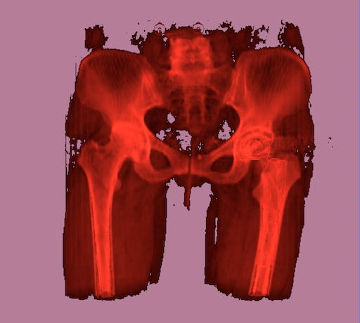

# Real-time ray tracing for Digitally Reconstructed Radiograph (DRR) generation

------------
By Javier Cuesta

The main goal of this project was to build a *physically-based* renderer that reconstructs digital radiographs in *real time*. The renderer produces radiographs at a rate of 60 Hertz without sacrificing precision in the physics simulation. Furthermore, it considers the exact radiological path of the x-ray source to make the renderer faithful to the physics process of radiograph generation.

The data consists of a set of computer tomography slices (usually called CTs) that can form a volumetric data set together. We render the volume by shooting rays from a common source and accumulating the density values. The sum of the collected values allows us to reconstruct a radiograph from the CTs. These computations are all done in the GPU to take advantage of the independence of rays in this process—moreover, rays generated inside a thread group benefit from the coherence of being inside the same bundle. 

When a ray intersects the volume, the ray steps through the driving axis, as shown in the image below. The driving axis is the axis with the largest ray direction component. Instead of a fixed ray path division, we take ray steps that depend on the number of slices and slice size. This avoids the bias that can happen from small radiological paths when the number of steps is constant. Finally, we do a linear interpolation inside the volume to estimate the density between slices.

We can change the range of radiodensity response to include or remove tissue in the rendered radiograph. For this matter, we can use the [Hounsfield scale](https://en.wikipedia.org/wiki/Hounsfield_scale) to distinguish bone structure from soft tissue. Below is a sample with response to soft tissue.

I wrote a compact SwiftUI application for visualizing in real-time the reconstructed radiographs produced by this ray tracer. In one of the modes, we can observe a rotating anatomical view (changing from the so-called "coronal" to the "sagittal" views) 

And in the other mode, we can freely move to any pose using the mouse or touchpad. Here we are using a "fly camera" to explore the scene. Check the source code of my other [project](https://github.com/jcubit/VRTracerSample) if you want to know how to do this in a ray tracer.

## Software and Hardware used

This project was written in *Metal* and [Swift](https://www.swift.org/about/). Metal is a C++14-based shading language with extensions and restrictions to the original specification (ISO/IEC JTC1/SC22/WG21 N4431). Although the standard library of Metal provides some ray tracing functionality, I wanted complete control of the intersection routines in the GPU to investigate intersection routines, so I wrote my own custom intersection shaders in the Metal Shading Language (MSL). Of course, one should use as much of the standard library as possible for a final production application. 

These demos ran on a MacBook Pro M1 with 16 GB of memory. The GPU in the M1 has eight cores with an L1 Cache of 128 KB for instructions and 64 KB for data.

